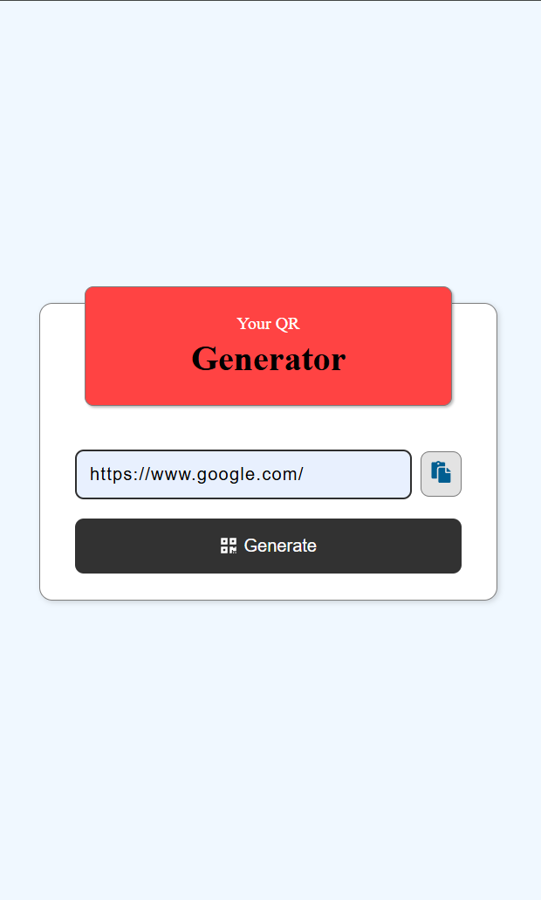
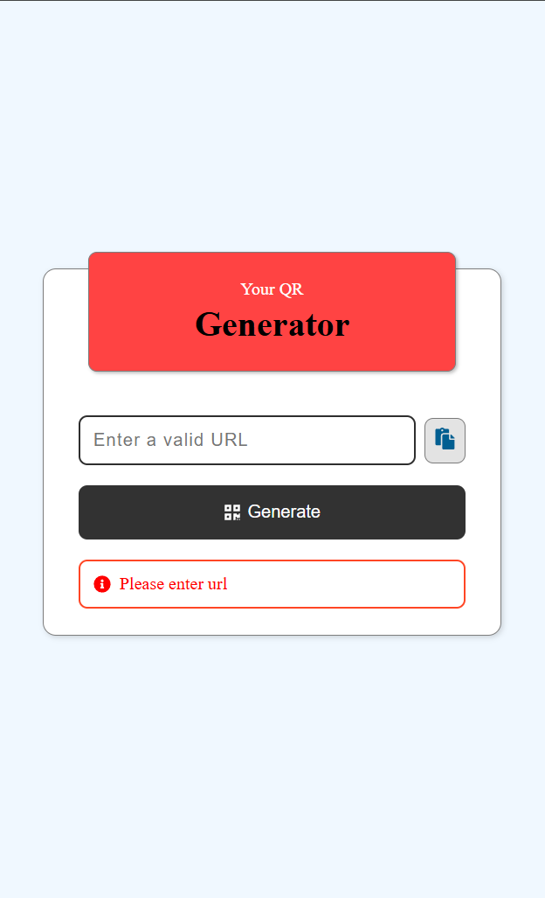

# React QR Code Generator

A simple **QR Code Generator** built with React and the `qrcode`
package.

## 🚀 Live Demo

[➡️ View Live App Here](https://qr-code-scanner-coral.vercel.app/)

## 🛠️ Tech Stack

- **React.js**

- **qrcode**

## 📱Screenshots

  

## 📌 Features

- **Generate** button (and Enter key) creates QR code inside

- **Shows Alerts** for errors in input or QR code generation

- **Clear** button resets input and QR code.

- **Download** button saves QR code as high-resolution PNG.

## 📂 Setup

```bash
git clone https://github.com/manish99verma/qr-code-scanner.git
cd react-qr-code
npm install
npm start
```
